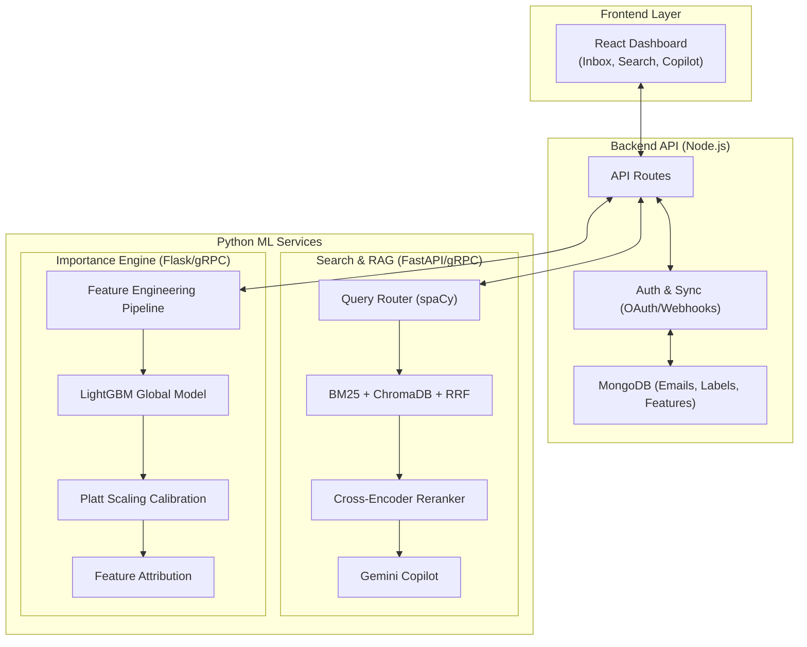

#  AI Email Manager

<div align="center">
---

## 👥 Team

Developed as a **next-generation intelligent inbox**, combining expertise in machine learning, full-stack engineering, semantic search, and natural language processing.

## 👥 Contributors

| Name | Role | College | Graduation Year | Email / Phone | GitHub |
| :--- | :--- | :--- | :---: | :--- | :--- |
| **[Nirbhay]** | Team Leader (ML) | [Nirma University] | 2028 | [24bce268@nirmauni.ac.in](mailto:24bce268@nirmauni.ac.in) / [8320586268] | [@itatshu](https://github.com/itatshu) |
| **[Het]** | Backend Engineer | [Nirma University] | 2028 | [24bce261@nirmauni.ac.in](mailto:24bce261@nirmauni.ac.in) / [9023226077] | [@Het6518](https://github.com/Het6518) |
| **[Darshan]** | ML Engineer | [Nirma University] | 2028 | [24bce233@nirmauni.ac.in](mailto:24bce233@nirmauni.ac.in) / [9328325601] | [@darshanNhb](https://github.com/darshanNhb) |
| **[Jenil]** | Frontend Engineer | [Nirma University] | 2028 | [24bce267@nirmauni.ac.in](mailto:24bce267@nirmauni.ac.in) / [9316130701] | [@MLinej](https://github.com/MLinej) |

---

<h3>⚡ Intelligent Semantic Search & Inbox Prioritization Platform</h3>

<p><em>Transforming the inbox from a chronological feed into a context-aware knowledge base.</em></p>

[](LICENSE)
[](https://python.org)
[](https://reactjs.org)
[](https://nodejs.org)
[](https://www.mongodb.com/)
[](https://lightgbm.readthedocs.io)

<br/>

> **AI Email Manager** is a production-quality hybrid email platform. It combines **structured Gmail-style operators, BM25 keyword search, semantic vector search, cross-encoder reranking, and a personalized ML importance engine** to help you find, understand, and prioritize your communications.

</div>

---

## 📋 Table of Contents

- [Problem Statement](#-problem-statement)
- [Key Features](#-key-features)
- [System Architecture](#-system-architecture)
- [Machine Learning Pipelines](#-machine-learning-pipelines)
- [Tech Stack](#-tech-stack)
- [Project Structure](#-project-structure)
- [Installation](#-installation)
- [Environment Variables](#-environment-variables)
- [Future Roadmap](#-future-roadmap)
- [Team](#-team)

---

## ⚡ Problem Statement

Standard email clients like Gmail and Outlook are built on outdated retrieval paradigms. Finding specific information requires exact keyword matches, deciding what to read first is overwhelming, and summarizing long threads is a manual, cognitive burden.

| Challenge | Impact |
|---|---|
| 🔴 Exact keyword search | Hard to find emails when you forget the exact phrasing |
| 🔴 High false positive rates | Traditional search returns too many irrelevant results |
| 🔴 Chronological sorting | Critical action items get buried under newsletters |
| 🔴 Manual labeling | High cognitive load to maintain inbox zero |

**AI Email Manager** solves these using a **hybrid semantic search engine, LLM-powered RAG, and an adaptive ML scoring model**.

---

## 🚀 Key Features

### 🔍 Production-Grade Hybrid Search
Our advanced search pipeline routes queries through multiple retrieval mechanisms simultaneously:
- **BM25 Keyword Search** (`rank_bm25`) for exact lexical matches.
- **Vector Semantic Search** (`ChromaDB` + `gte-Qwen2-1.5B-instruct`) to find emails by meaning.
- **Cross-Encoder Reranking** (`bge-reranker-v2-m3`) for state-of-the-art relevance sorting.
- **Reciprocal Rank Fusion (RRF)** to perfectly balance keyword and semantic scores.

### 🧠 Personalized Importance Engine
A multi-phase ML pipeline built on LightGBM. It learns from your explicit onboarding labels and implicit behavior (opens, replies, stars) to predict email importance, sorting the signal from the noise.

### 🤖 AI Email Copilot (RAG)
Chat directly with your inbox using the Gemini LLM. Ask questions like:
> *"What were the action items from yesterday's marketing sync?"*

The Copilot retrieves relevant emails via our hybrid search pipeline and generates grounded, factual answers.

### 💡 Explainable AI (XAI)
The importance engine explains *why* an email is scored highly. Using feature attribution (`pred_contrib=True`), the UI displays human-readable reasons like *"Mentions an application deadline"* or *"Similar to emails you've marked important before"*.

### ⚡ Real-Time Gmail Sync
Seamless Google OAuth integration and Gmail Pub/Sub webhooks ensure your dashboard is always synchronized in real-time.

---

## 🏗 System Architecture



---

## 🧠 Machine Learning Pipelines

### 1. Hybrid Search & Retrieval (RAG)
- **Natural Language Parsing**: Uses `spaCy` to extract intent and entities from plain-text queries, supporting Gmail operators (`from:sarah after:2024/01/01`).
- **Parallel Retrieval**: Fires queries simultaneously to MongoDB (Metadata), `rank_bm25`, and `ChromaDB`.
- **Fusion**: Uses RRF (k=60) to merge discrete sparse and dense ranked lists.
- **Reranker**: A cross-encoder validates the top K results for maximum precision.

### 2. Importance Engine (LightGBM)
Uses a **Global Bootstrap Model + Per-User Calibration**:
- **Feature Extraction**: Generates 25+ features (temporal trends, sender history, regex content flags, embedding centroids).
- **Global Model**: A single LightGBM binary classifier trained across all users to prevent overfitting on low-data accounts.
- **Platt Scaling**: Adjusts the global model's probabilities to the specific baseline of each individual user.

---

## 💻 Tech Stack

### Frontend
- **React.js 18** + **Vite**
- **Tailwind CSS v4** (Dark mode, animations, responsive layout)

### Backend
- **Node.js** + **Express.js**
- **MongoDB** + **Mongoose** (Document DB)
- **Google APIs** (Gmail API, Pub/Sub)

### Machine Learning & Data Science
- **Python 3.11+**
- **Search**: `FastAPI`, `gRPC`, `ChromaDB`, `rank_bm25`, `spaCy`
- **Models**: `gte-Qwen2-1.5B-instruct` (Embeddings), `bge-reranker-v2-m3` (Reranker)
- **Importance Engine**: `LightGBM`, `scikit-learn`, `Pandas`
- **LLM**: Google Gemini API

---

## 📂 Project Structure

```text
Email-Manager/
│
├── backend/                  # Node.js API server (Auth, Webhooks, Orchestration)
├── frontend/                 # React UI (Dashboard, Inbox, AI Chat)
│
├── search_feature_demo/      # 🔍 Python Hybrid Search & RAG microservice
│   ├── grpc_app/             # gRPC communication layer
│   ├── retrieval/            # BM25, ChromaDB, and RRF logic
│   ├── router/               # Query intent parsing (spaCy)
│   └── llm/                  # Gemini AI Copilot orchestration
│
├── feature_engineering/      # ⚙️ ML Feature Extraction Pipeline
│   ├── sender_features.py    # Sender domain and history analysis
│   ├── content_features.py   # NLP and regex-based content flags
│   └── time_features.py      # Temporal heuristics
│
├── python-service/           # 🧠 Importance Scoring & Inference API
│   ├── train_global.py       # Global LightGBM bootstrap training
│   ├── calibration.py        # Per-user Platt scaling
│   └── app.py                # Scoring endpoint with XAI (SHAP)
│
└── README.md
```

---

## 📦 Installation

### Prerequisites
- Node.js `v18+`
- Python `3.11+`
- MongoDB running on `localhost:27017`
- NVIDIA GPU with CUDA support (Recommended for search pipeline)

### 1. Clone the Repository
```bash
git clone https://github.com/Nirbhay71/Email-Manager.git
cd Email-Manager
```

### 2. Backend Setup
```bash
cd backend
npm install
npm run dev                # Starts API on port 3000
```

### 3. Frontend Setup
```bash
cd frontend
npm install
npm run dev                # Starts UI on port 5173
```

### 4. Search & RAG Microservice
```bash
cd search_feature_demo
python -m venv venv
source venv/bin/activate   # Windows: venv\Scripts\activate
pip install torch --index-url https://download.pytorch.org/whl/cu121 # Install CUDA first
pip install -r requirements.txt
python -m spacy download en_core_web_sm
python main.py             # Starts HTTP (8001) and gRPC (50052)
```

### 5. Importance Engine Microservice
```bash
cd python-service
python -m venv venv
source venv/bin/activate
pip install -r requirements.txt
python app.py              # Starts Scoring API
```

---

## 🔧 Environment Variables

Create `.env` files in the respective directories:

**Backend (`backend/.env`)**
```env
PORT=3000
MONGO_URI=mongodb://localhost:27017/ai_email_manager
GMAIL_CLIENT_ID=your_client_id
GMAIL_CLIENT_SECRET=your_client_secret
GMAIL_REDIRECT_URI=http://localhost:3000/auth/google/callback
GMAIL_PUBSUB_TOPIC=projects/your-project/topics/your-topic
```

**Python Search Service (`search_feature_demo/.env`)**
```env
MONGO_URI=mongodb://localhost:27017/ai_email_manager
CHROMA_PERSIST_DIR=./chroma_data
GEMINI_API_KEY=your_gemini_api_key
SEARCH_HTTP_PORT=8001
SEARCH_GRPC_PORT=50052
DEVICE=auto
```

---

## 🔮 Future Roadmap

- [ ] **Historical 6-Month Backfill** — Bulk embedding pipeline for initializing new users quickly.
- [ ] **Automated Draft Generation** — Let the AI Copilot auto-draft replies to flagged high-importance emails.
- [ ] **Action Item Extraction Dashboard** — Dedicated kanban board for extracted tasks and deadlines.
- [ ] **Edge AI Deployment** — Run lightweight embeddings locally in the browser via ONNX for absolute privacy.

## 📜 License

This project is licensed under the **MIT License** — see the [LICENSE](LICENSE) file for details.

---

<div align="center">

**Built with 💡 to revolutionize digital communication.**

*AI Email Manager — Search. Understand. Prioritize.*

</div>
