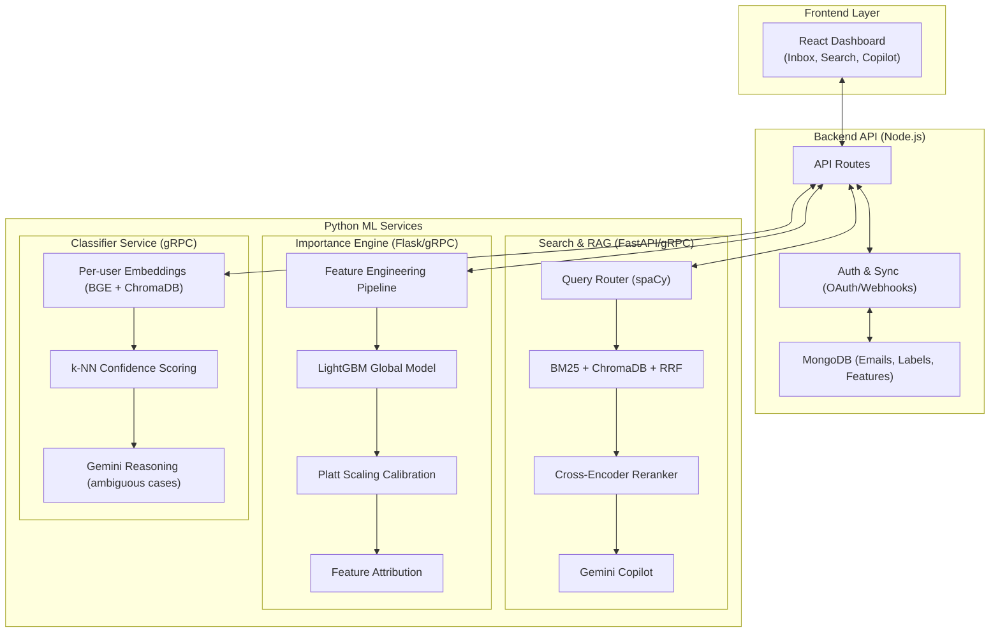

#  MailSense

<div align="center">
---

## 👥 Team

Developed as a **next-generation intelligent inbox**, combining expertise in machine learning, full-stack engineering, semantic search, and natural language processing.

## 👥 Contributors

| Name | College | Graduation Year | Email / Phone | GitHub |
| :--- | :--- | :---: | :--- | :--- |
| **Nirbhay** | Nirma University | 2028 | [24bce268@nirmauni.ac.in](mailto:24bce268@nirmauni.ac.in)<br>8320586268 | [@itatshu](https://github.com/itatshu) |
| **Darshan** | Nirma University | 2028 | [buddhdevdarshan1478@gmail.com](mailto:buddhdevdarshan1478@gmail.com)<br>9328325601 | [@darshanNhb](https://github.com/darshanNhb) |

---

<h3>⚡ Intelligent Semantic Search & Inbox Prioritization Platform</h3>

<p><em>Transforming the inbox from a chronological feed into a context-aware knowledge base.</em></p>

[](https://python.org)
[](https://reactjs.org)
[](https://nodejs.org)
[](https://www.mongodb.com/)
[](https://lightgbm.readthedocs.io)

<br/>

> **MailSense** is a hybrid email platform. It combines **structured Gmail-style operators, BM25 keyword search, semantic vector search, cross-encoder reranking, and a personalized ML importance engine** to help you find, understand, and prioritize your communications.

</div>

---

## 📋 Table of Contents

- [Problem Statement](#-problem-statement)
- [Key Features](#-key-features)
- [System Architecture](#-system-architecture)
- [Machine Learning Pipelines](#-machine-learning-pipelines)
- [Detailed Tech Stack](#-detailed-tech-stack)
- [Comprehensive Folder Structure](#-comprehensive-folder-structure)
- [Installation](#-installation)
- [Environment Variables](#-environment-variables)
- [Future Roadmap](#-future-roadmap)
- [Team](#-team)

---

## ⚡ Problem Statement

Standard email clients like Gmail and Outlook are built on outdated retrieval paradigms. Finding specific information requires exact keyword matches, deciding what to read first is overwhelming, and summarizing long threads is a manual, cognitive burden.

| Challenge | Impact |
|---|---|
| 🔴 Exact keyword search | Hard to find emails when you forget the exact phrasing |
| 🔴 High false positive rates | Traditional search returns too many irrelevant results |
| 🔴 Chronological sorting | Critical action items get buried under newsletters |
| 🔴 Manual labeling | High cognitive load to maintain inbox zero |

**MailSense** solves these using a **hybrid semantic search engine, LLM-powered RAG, and an adaptive ML scoring model**.

---

## 🚀 Key Features

### 🔍 Hybrid Search
Our advanced search pipeline routes queries through multiple retrieval mechanisms simultaneously:
- **BM25 Keyword Search** (`rank_bm25`) for exact lexical matches.
- **Vector Semantic Search** (`ChromaDB` + `gte-Qwen2-1.5B-instruct`) to find emails by meaning.
- **Cross-Encoder Reranking** (`bge-reranker-v2-m3`) for state-of-the-art relevance sorting.
- **Reciprocal Rank Fusion (RRF)** to perfectly balance keyword and semantic scores.

### 🧠 Personalized Importance Engine
A multi-phase ML pipeline built on LightGBM. It learns from your explicit onboarding labels and implicit behavior (opens, replies, stars) to predict email importance, sorting the signal from the noise.

### 🤖 AI Email Copilot (RAG)
Chat directly with your inbox using the Gemini LLM. Ask questions like:
> *"What were the action items from yesterday's marketing sync?"*

The Copilot retrieves relevant emails via our hybrid search pipeline and generates grounded, factual answers.

### 💡 Explainable AI (XAI)
The importance engine explains *why* an email is scored highly. Using feature attribution (`pred_contrib=True`), the UI displays human-readable reasons like *"Mentions an application deadline"* or *"Similar to emails you've marked important before"*.

### ⚡ Real-Time Gmail Sync
Seamless Google OAuth integration and Gmail Pub/Sub webhooks ensure your dashboard is always synchronized in real-time.

### 🏷️ Custom Categories & Auto-Classification
Each user defines their own categories and manually assigns a handful of emails to each. Once a category crosses a configurable example threshold, a dedicated classifier microservice starts auto-tagging new incoming mail into it — a fast k-NN pass over per-user email embeddings handles clear-cut cases, falling back to a Gemini reasoning call (comparing candidate categories via an auto-maintained summary) only when the match is ambiguous. Low-confidence picks are flagged "needs review" and correctable with one click, which feeds back into training.

### 📅 User-Controlled Calendar Events
Dates detected in incoming email are surfaced as a "Deadline" chip, not auto-added to Google Calendar — the user adds or removes the event with one click, since not every detected date is worth scheduling.

---

## 🏗 System Architecture



---

## 💻 Detailed Tech Stack

Our platform leverages a specialized stack distributed across Node.js and Python microservices to ensure real-time API responsiveness while performing heavy machine learning computation.

### Frontend Application
- **React.js 18**: Component-based UI library ensuring highly interactive dashboard performance.
- **Vite**: Ultra-fast build tool and development server providing instant Hot Module Replacement (HMR).
- **Tailwind CSS v4**: Utility-first CSS framework. Extensively used for our dark-mode interface, dynamic Importance Badges, and fluid micro-animations.
- **Axios**: Intercepts HTTP requests and manages JWT/session headers for secure backend communication.

### Backend Infrastructure (API & Synchronization)
- **Node.js & Express.js**: Event-driven architecture perfectly suited for handling high-throughput Google Pub/Sub Webhooks whenever a new email arrives.
- **MongoDB & Mongoose**: Used as the primary operational database. Its document-oriented structure naturally maps to raw email JSON payloads and provides rapid metadata-filtering via indexes.
- **Google Cloud APIs (Gmail & OAuth 2.0)**: Manages secure user authentication, watch subscriptions, and message fetching.

### Machine Learning & Data Science (Python)
- **FastAPI**: Provides a high-concurrency async REST interface for the search engine.
- **gRPC (Google Remote Procedure Calls)**: Enables ultra-low-latency binary communication between the Node.js backend and the Python ML services (avoiding HTTP overhead for high-frequency scoring/embedding requests).
- **ChromaDB**: The primary Vector Database. Selected for its lightweight local persistency, making it perfect for storing dense semantic embeddings of email subjects and bodies.
- **SentenceTransformers**: Framework used for embedding generation.
- **scikit-learn & Pandas**: Core libraries for the Feature Engineering pipeline, dataset handling, and Platt Scaling calibration.

### Specific AI & NLP Models
- **gte-Qwen2-1.5B-instruct (Embeddings)**: A 1.5-billion parameter embedding model by Alibaba. It generates highly contextual dense vectors for semantic search, heavily outperforming basic models.
- **bge-reranker-v2-m3 (Cross-Encoder)**: A heavy, highly accurate model that takes a query and a retrieved email, processes them *together*, and outputs an absolute relevance score. This acts as the final quality filter in the search pipeline.
- **LightGBM (Importance Engine)**: A gradient boosting framework created by Microsoft. Selected over deep learning because it handles tabular (feature-engineered) and categorical data significantly faster and with higher accuracy on small datasets.
- **spaCy (en_core_web_sm)**: A lightweight, deterministic NLP library used to parse search queries for intent, dates, and named entities without the latency of an LLM call.
- **Google Gemini API (LLM)**: The foundational Large Language Model used to power the RAG (Retrieval-Augmented Generation) chat interface.

---

## 📂 Comprehensive Folder Structure

> **Note:** the Importance Engine / feature-engineering pipeline described in
> [Key Features](#-key-features) and the architecture diagram above is the
> project's design goal — `feature_engineering/` and
> `python-service/importance_model/` don't exist in this repo yet, and
> `python-service/` currently only runs a legacy gRPC search/Q&A service
> that predates `search_feature_demo/` and isn't wired into the backend
> (see [`docs/okf/operations/known-issues.md`](docs/okf/operations/known-issues.md)).
> The folder tree below reflects what's actually in the repo today.

```text
Email-Manager/
│
├── backend/                       # 🟢 Node.js API server (Auth, Webhooks, Orchestration)
│   └── src/
│       ├── config/                # Google OAuth client configuration
│       ├── controllers/           # Request handlers (auth, webhook, chat, calendar, category, email)
│       ├── grpc/                  # gRPC client stubs for search_feature_demo's SearchService and classifier-service's EmailClassifier
│       ├── middleware/            # requireAuth (JWT) and verifyPubSub (webhook OIDC verification)
│       ├── models/                # Mongoose schemas (User, Email, Category, ChatSession)
│       ├── routes/                # Express API endpoints (/auth, /ask, /search, /chat, /calendar, /categories, /emails, /webhook)
│       ├── service/ & services/   # Core business logic (gmail, calendar, dateExtractor, sms, embeddingClient)
│       └── utils/                 # token.utils.js (JWT/cookies), crypto.utils.js (token encryption/hashing)
│
├── frontend/                      # 🔵 React UI (Login, Inbox, All Mail, AI Chat, Management)
│   └── src/
│       ├── assets/                # Global CSS (Tailwind index), static images
│       ├── components/inbox/      # InboxCard (list, search, add/remove event, categorize picker), CategoriesCard, CalendarCard
│       ├── pages/                 # LoginPage, InboxPage, MailPage, AIChatPage, ManagementPage
│       └── utils/                 # api.ts — fetch wrapper with cookie auth + silent token refresh
│
├── search_feature_demo/           # 🔍 Python Hybrid Search & RAG microservice (the one the backend actually talks to)
│   ├── grpc_app/                  # gRPC server: Search, EmbedAndStore, AskQuestion (AI chat)
│   ├── api/                       # FastAPI HTTP server (direct/manual search access, not used by the backend)
│   ├── llm/                       # Gemini Copilot prompt construction + streaming, with key rotation
│   ├── embeddings/, reranking/    # Embedding + cross-encoder model wrappers
│   ├── retrieval/                 # rank_bm25, ChromaDB, MongoDB metadata search, RRF fusion
│   ├── router/                    # Query intent parsing (spaCy) and Gmail-style operator extraction
│   ├── pipeline/                  # Orchestrates the above into one search call
│   └── main.py                    # Entry point for FastAPI (8001) and gRPC (50052)
│
├── python-service/                # 🧠 Legacy Q&A gRPC service — not currently used by the backend
│   └── server.py                  # Older EmailSearchService (EmbedAndStore, AskQuestion) on port 50051
│
├── classifier-service/            # 🏷️ Per-user email category classifier (gRPC, port 50053)
│   ├── protos/classifier.proto    # EmailClassifier service: EmbedAndStore, Classify, AddFeedback, GetCategoryStatus
│   ├── services/                  # classifier_embedder (BGE), classifier_chroma_store (per-user Chroma collections)
│   ├── services/pipeline/         # retrieval → confidence scoring → (lazy summary refresh +) Gemini reasoning orchestrator
│   └── classifier_server.py       # Entry point — generates its own gRPC stubs on first run
│
├── docs/
│   ├── SECURITY_NOTES.md          # What's been hardened and what's still open
│   └── okf/                       # Internal knowledge base (architecture notes, known issues)
│
├── SECRET_ROTATION_CHECKLIST.md   # Manual steps to rotate/generate secrets before deploying
└── README.md                      # This document
```

---

## 🧠 Machine Learning Pipelines

### 1. Hybrid Search & Retrieval (RAG)
- **Natural Language Parsing**: Uses `spaCy` to extract intent and entities from plain-text queries, supporting Gmail operators (`from:sarah after:2024/01/01`).
- **Parallel Retrieval**: Fires queries simultaneously to MongoDB (Metadata), `rank_bm25`, and `ChromaDB`.
- **Fusion**: Uses RRF (k=60) to merge discrete sparse and dense ranked lists.
- **Reranker**: A cross-encoder validates the top K results for maximum precision.
- **AI Copilot (`AskQuestion`)**: Retrieves context via the same pipeline, then streams a grounded answer from Gemini, rotating across up to 4 configured API keys as each hits its quota.

### 2. Per-User Email Classification
- **Manual bootstrap**: each user creates categories and labels a handful of emails into them via the inbox's inline picker.
- **Per-user vector store**: every labeled example is embedded (`BAAI/bge-large-en-v1.5`) and stored in a Chroma collection scoped to that user only.
- **Fast path**: a new email's embedding is compared via k-NN against the user's labeled examples; a clear, high-margin match is applied immediately, no LLM call.
- **Ambiguous path**: when the top matches are close, Gemini reasons between the candidate categories using an auto-maintained (and lazily refreshed) summary of each — cheaper than re-sending every example.
- **Threshold gating**: a category only starts auto-classifying once it has enough manually-labeled examples (`MIN_EXAMPLES_PER_CATEGORY`, default 15); below that, predictions are always flagged "needs review".
- **Feedback loop**: confirming or correcting a prediction (via the same picker) retrains that example in place — a correction also cleans up the old, wrongly-labeled vector.

### 3. Importance Engine (LightGBM) — planned, not yet implemented
The global-model-plus-per-user-calibration design described above is the
target architecture; the feature-engineering pipeline and scoring API it
depends on haven't been built in this repo yet.

---

## 📦 Installation

Four services need to run together for the full app to work: **backend**
(Node/Express API), **frontend** (React/Vite UI), **search_feature_demo**
(Python — search, RAG/AI chat, embeddings), and **classifier-service**
(Python — per-user category classification). Start them in this order so
each one has what it depends on when it starts.

### Prerequisites
- Node.js `v18+`
- Python `3.11+`
- MongoDB running locally (all backend services must point at the *same* instance/database)
- NVIDIA GPU with CUDA support (recommended for the search pipeline; CPU also works, just slower)
- A [Gemini API key](https://aistudio.google.com/apikey) (up to 4, for automatic quota rotation — see below)

### 1. Clone the Repository
```bash
git clone https://github.com/Nirbhay71/Email-Manager.git
cd Email-Manager
```

### 2. Configure environment variables
Copy the `.env.example` in each service directory to `.env` and fill in
real values — see [Environment Variables](#-environment-variables) below
for what each one does and how to generate the secrets:
```bash
cp backend/src/.env.example backend/src/.env
cp frontend/.env.example frontend/.env
cp search_feature_demo/.env.example search_feature_demo/.env
cp classifier-service/.env.example classifier-service/.env
```

### 3. Backend Setup
```bash
cd backend
npm install
npm run dev                # Starts API on http://localhost:5000
```

### 4. Frontend Setup
```bash
cd frontend
npm install
npm run dev                # Starts UI on http://localhost:5173
```

### 5. Search, RAG & AI Chat Microservice
This is the service the backend actually talks to for `/search/v2` and `/ask`.
```bash
cd search_feature_demo
python -m venv venv
source venv/bin/activate   # Windows: venv\Scripts\activate
pip install torch --index-url https://download.pytorch.org/whl/cu121 # Install CUDA first
pip install -r requirements.txt
python -m spacy download en_core_web_sm
python main.py             # Starts HTTP (8001) and gRPC (50052)
```

### 6. Category Classifier Microservice
Powers auto-classification once a category has enough manually-labeled examples.
```bash
cd classifier-service
python -m venv venv
source venv/bin/activate   # Windows: venv\Scripts\activate
pip install -r requirements.txt
python classifier_server.py   # Starts gRPC on port 50053; downloads the BGE embedding model on first run
```

### 7. Sign in
Open `http://localhost:5173`, sign in with Google, and the OAuth flow will
create your user record and start syncing your inbox.

`python-service/` is legacy and doesn't need to be running for the app to
work — see the [Folder Structure](#-comprehensive-folder-structure) note above.

---

## 🔧 Environment Variables

Copy each `.env.example` to `.env` in the same directory rather than typing
these from scratch — it documents every variable inline. Summary:

**Backend (`backend/src/.env`)** — note the path: `backend/src/index.js` loads dotenv from `./src/.env`, not `backend/.env`.
```env
PORT=5000
NODE_ENV=development                 # "production" once actually deployed — flips cookies to Secure-only
FRONTEND_URL=http://localhost:5173
MONGO_URI=mongodb://localhost:27017/ai_email_manager

# Google OAuth (Cloud Console → APIs & Services → Credentials)
GOOGLE_CLIENT_ID=your_client_id
GOOGLE_CLIENT_SECRET=your_client_secret
GOOGLE_REDIRECT_URI=http://localhost:5000/auth/google/callback
GMAIL_PUBSUB_TOPIC=projects/your-project/topics/your-topic

# Gmail Pub/Sub webhook verification — required outside NODE_ENV=development
PUBSUB_AUDIENCE=
PUBSUB_SERVICE_ACCOUNT_EMAIL=

# Auth secrets — generate with: node -e "console.log(require('crypto').randomBytes(48).toString('hex'))"
JWT_ACCESS_SECRET=
# 32-byte (64 hex char) key encrypting stored Google tokens at rest — generate with randomBytes(32)
TOKEN_ENCRYPTION_KEY=

# Shared secret with all three Python services below (same value in every .env file).
# Required for the gRPC calls to actually be accepted once those services run with ENVIRONMENT=production.
SERVICE_TOKEN=
HYBRID_SEARCH_GRPC_HOST=localhost:50052
CLASSIFIER_GRPC_HOST=localhost:50053

# Twilio (SMS deadline alerts) — SMS_ENABLED defaults to false because
# sendTestSms always texts TWILIO_TEST_TO_NUMBER, not the signed-in user;
# only turn it on once per-user phone numbers exist.
TWILIO_ACCOUNT_SID=
TWILIO_AUTH_TOKEN=
TWILIO_FROM_NUMBER=
TWILIO_TEST_TO_NUMBER=
SMS_ENABLED=false
```

**Frontend (`frontend/.env`)**
```env
# Backend API origin — only needs to change once frontend and backend are hosted on different origins.
VITE_API_URL=http://localhost:5000
```

**Python Search Service (`search_feature_demo/.env`)**
```env
MONGO_URI=mongodb://localhost:27017/ai_email_manager
CHROMA_PERSIST_DIR=./chroma_data
SEARCH_HTTP_PORT=8001
SEARCH_GRPC_PORT=50052
DEVICE=auto

# Up to 4 keys — the AI chat rotates to the next one when the current key
# hits its quota, and replies "out of tokens" once all are exhausted.
GEMINI_API_KEY_1=your_gemini_api_key
GEMINI_API_KEY_2=
GEMINI_API_KEY_3=
GEMINI_API_KEY_4=

# Must match backend's SERVICE_TOKEN. Leave SERVICE_TOKEN empty only with ENVIRONMENT=development.
SERVICE_TOKEN=
ENVIRONMENT=development
CORS_ALLOWED_ORIGINS=http://localhost:5173
```

**Classifier Service (`classifier-service/.env`)**
```env
MONGO_URI=mongodb://localhost:27017/ai_email_manager   # must match the backend's MONGO_URI exactly
GEMINI_API_KEY=your_gemini_api_key
CHROMA_PERSIST_DIR=./chroma_data_classifier
GRPC_PORT=50053
MIN_EXAMPLES_PER_CATEGORY=15   # examples a category needs before auto-classify turns on

# Must match backend's SERVICE_TOKEN. Leave SERVICE_TOKEN empty only with ENVIRONMENT=development.
SERVICE_TOKEN=
ENVIRONMENT=development
```

See each service's `.env.example` for the full, inline-documented list
(retrieval tuning, timeouts, cache, confidence thresholds, and
`python-service/.env.example` if you're running the legacy service).
`SECRET_ROTATION_CHECKLIST.md` has step-by-step commands for generating
every secret above.

---

## 🔮 Future Roadmap

- [ ] **Historical 1-6 Month Backfill** — Bulk embedding pipeline for initializing new users quickly.
- [ ] **Automated Draft Generation** — Let the AI Copilot auto-draft replies to flagged high-importance emails.
- [ ] **Action Item Extraction Dashboard** — Dedicated kanban board for extracted tasks and deadlines.
- [ ] **Edge AI Deployment** — Run lightweight embeddings locally in the browser via ONNX for absolute privacy.

---

<div align="center">

**Built with 💡 to revolutionize digital communication.**

*MailSense — Search, Understand, Prioritize.*

</div>
