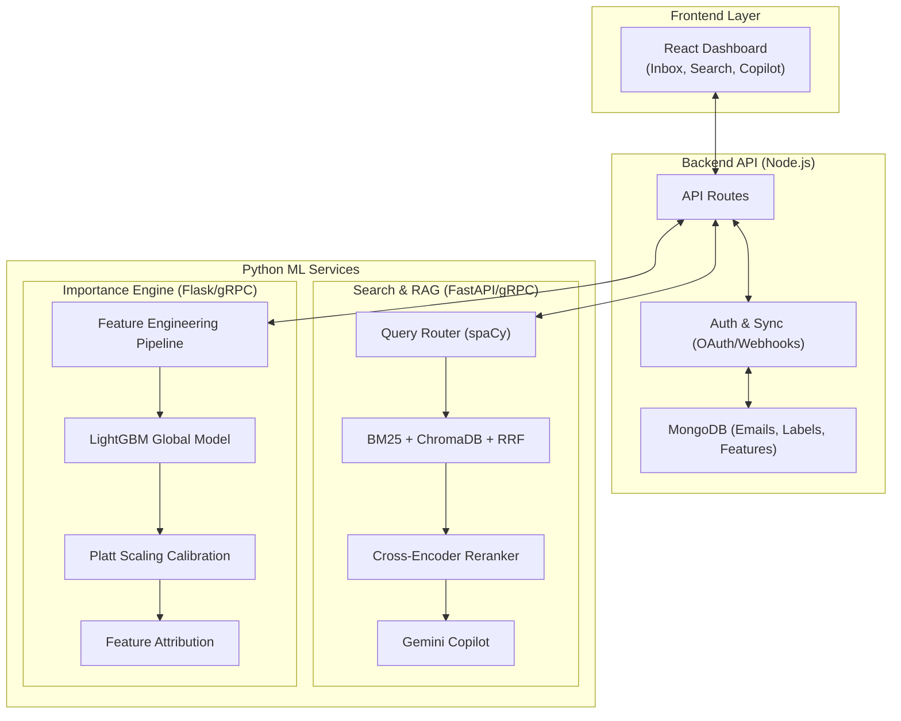

#  MailSense

<div align="center">
---

## 👥 Team

Developed as a **next-generation intelligent inbox**, combining expertise in machine learning, full-stack engineering, semantic search, and natural language processing.

## 👥 Contributors

| Name | College | Graduation Year | Email / Phone | GitHub |
| :--- | :--- | :---: | :--- | :--- |
| **Nirbhay** | Nirma University | 2028 | [24bce268@nirmauni.ac.in](mailto:24bce268@nirmauni.ac.in)<br>8320586268 | [@itatshu](https://github.com/itatshu) |
| **Darshan** | Nirma University | 2028 | [buddhdevdarshan1478@gmail.com](mailto:buddhdevdarshan1478@gmail.com)<br>9328325601 | [@darshanNhb](https://github.com/darshanNhb) |

---

<h3>⚡ Intelligent Semantic Search & Inbox Prioritization Platform</h3>

<p><em>Transforming the inbox from a chronological feed into a context-aware knowledge base.</em></p>

[](https://python.org)
[](https://reactjs.org)
[](https://nodejs.org)
[](https://www.mongodb.com/)
[](https://lightgbm.readthedocs.io)

<br/>

> **MailSense** is a production-quality hybrid email platform. It combines **structured Gmail-style operators, BM25 keyword search, semantic vector search, cross-encoder reranking, and a personalized ML importance engine** to help you find, understand, and prioritize your communications.

</div>

---

## 📋 Table of Contents

- [Problem Statement](#-problem-statement)
- [Key Features](#-key-features)
- [System Architecture](#-system-architecture)
- [Machine Learning Pipelines](#-machine-learning-pipelines)
- [Detailed Tech Stack](#-detailed-tech-stack)
- [Comprehensive Folder Structure](#-comprehensive-folder-structure)
- [Installation](#-installation)
- [Environment Variables](#-environment-variables)
- [Future Roadmap](#-future-roadmap)
- [Team](#-team)

---

## ⚡ Problem Statement

Standard email clients like Gmail and Outlook are built on outdated retrieval paradigms. Finding specific information requires exact keyword matches, deciding what to read first is overwhelming, and summarizing long threads is a manual, cognitive burden.

| Challenge | Impact |
|---|---|
| 🔴 Exact keyword search | Hard to find emails when you forget the exact phrasing |
| 🔴 High false positive rates | Traditional search returns too many irrelevant results |
| 🔴 Chronological sorting | Critical action items get buried under newsletters |
| 🔴 Manual labeling | High cognitive load to maintain inbox zero |

**MailSense** solves these using a **hybrid semantic search engine, LLM-powered RAG, and an adaptive ML scoring model**.

---

## 🚀 Key Features

### 🔍 Production-Grade Hybrid Search
Our advanced search pipeline routes queries through multiple retrieval mechanisms simultaneously:
- **BM25 Keyword Search** (`rank_bm25`) for exact lexical matches.
- **Vector Semantic Search** (`ChromaDB` + `gte-Qwen2-1.5B-instruct`) to find emails by meaning.
- **Cross-Encoder Reranking** (`bge-reranker-v2-m3`) for state-of-the-art relevance sorting.
- **Reciprocal Rank Fusion (RRF)** to perfectly balance keyword and semantic scores.

### 🧠 Personalized Importance Engine
A multi-phase ML pipeline built on LightGBM. It learns from your explicit onboarding labels and implicit behavior (opens, replies, stars) to predict email importance, sorting the signal from the noise.

### 🤖 AI Email Copilot (RAG)
Chat directly with your inbox using the Gemini LLM. Ask questions like:
> *"What were the action items from yesterday's marketing sync?"*

The Copilot retrieves relevant emails via our hybrid search pipeline and generates grounded, factual answers.

### 💡 Explainable AI (XAI)
The importance engine explains *why* an email is scored highly. Using feature attribution (`pred_contrib=True`), the UI displays human-readable reasons like *"Mentions an application deadline"* or *"Similar to emails you've marked important before"*.

### ⚡ Real-Time Gmail Sync
Seamless Google OAuth integration and Gmail Pub/Sub webhooks ensure your dashboard is always synchronized in real-time.

---

## 🏗 System Architecture



---

## 💻 Detailed Tech Stack

Our platform leverages a specialized stack distributed across Node.js and Python microservices to ensure real-time API responsiveness while performing heavy machine learning computation.

### Frontend Application
- **React.js 18**: Component-based UI library ensuring highly interactive dashboard performance.
- **Vite**: Ultra-fast build tool and development server providing instant Hot Module Replacement (HMR).
- **Tailwind CSS v4**: Utility-first CSS framework. Extensively used for our dark-mode interface, dynamic Importance Badges, and fluid micro-animations.
- **Axios**: Intercepts HTTP requests and manages JWT/session headers for secure backend communication.

### Backend Infrastructure (API & Synchronization)
- **Node.js & Express.js**: Event-driven architecture perfectly suited for handling high-throughput Google Pub/Sub Webhooks whenever a new email arrives.
- **MongoDB & Mongoose**: Used as the primary operational database. Its document-oriented structure naturally maps to raw email JSON payloads and provides rapid metadata-filtering via indexes.
- **Google Cloud APIs (Gmail & OAuth 2.0)**: Manages secure user authentication, watch subscriptions, and message fetching.

### Machine Learning & Data Science (Python)
- **FastAPI**: Provides a high-concurrency async REST interface for the search engine.
- **gRPC (Google Remote Procedure Calls)**: Enables ultra-low-latency binary communication between the Node.js backend and the Python ML services (avoiding HTTP overhead for high-frequency scoring/embedding requests).
- **ChromaDB**: The primary Vector Database. Selected for its lightweight local persistency, making it perfect for storing dense semantic embeddings of email subjects and bodies.
- **SentenceTransformers**: Framework used for embedding generation.
- **scikit-learn & Pandas**: Core libraries for the Feature Engineering pipeline, dataset handling, and Platt Scaling calibration.

### Specific AI & NLP Models
- **gte-Qwen2-1.5B-instruct (Embeddings)**: A 1.5-billion parameter embedding model by Alibaba. It generates highly contextual dense vectors for semantic search, heavily outperforming basic models.
- **bge-reranker-v2-m3 (Cross-Encoder)**: A heavy, highly accurate model that takes a query and a retrieved email, processes them *together*, and outputs an absolute relevance score. This acts as the final quality filter in the search pipeline.
- **LightGBM (Importance Engine)**: A gradient boosting framework created by Microsoft. Selected over deep learning because it handles tabular (feature-engineered) and categorical data significantly faster and with higher accuracy on small datasets.
- **spaCy (en_core_web_sm)**: A lightweight, deterministic NLP library used to parse search queries for intent, dates, and named entities without the latency of an LLM call.
- **Google Gemini API (LLM)**: The foundational Large Language Model used to power the RAG (Retrieval-Augmented Generation) chat interface.

---

## 📂 Comprehensive Folder Structure

The project is structured into strict microservices to enforce a separation of concerns between I/O bound web traffic and CPU/GPU bound ML workloads.

```text
Email-Manager/
│
├── backend/                       # 🟢 Node.js API server (Auth, Webhooks, Orchestration)
│   └── src/
│       ├── config/                # Database and OAuth credentials configuration
│       ├── controllers/           # Request handlers (webhook processing, auth callbacks)
│       ├── grpc/                  # gRPC client stubs to communicate with Python services
│       ├── models/                # Mongoose Schemas (Email, EmailLabel, SyncState)
│       ├── routes/                # Express API endpoints (/inbox, /onboarding, /search)
│       └── services/              # Core business logic (gmail.service.js, inboxSampler.js)
│
├── frontend/                      # 🔵 React UI (Dashboard, Inbox, AI Chat)
│   └── src/
│       ├── assets/                # Global CSS (Tailwind index), static images
│       ├── components/            # Reusable UI (ImportanceBadge, Explainability Tooltips)
│       └── pages/                 # Full views: InboxPage, SearchPage, OnboardingLabeling
│
├── search_feature_demo/           # 🔍 Python Hybrid Search & RAG microservice
│   ├── grpc_app/                  # gRPC server exposing EmbedAndStore routines
│   ├── llm/                       # Gemini AI Copilot context orchestration
│   ├── models/                    # Scripts to download and cache HuggingFace weights
│   ├── retrieval/                 # Search core: rank_bm25, ChromaDB management, RRF logic
│   ├── router/                    # Query intent parsing and operator extraction via spaCy
│   └── main.py                    # Entry point for FastAPI (8001) and gRPC (50052)
│
├── feature_engineering/           # ⚙️ ML Feature Extraction Pipeline
│   ├── sender_features.py         # Analyzes sender domains and historical contact frequency
│   ├── content_features.py        # Extracts NLP flags (urgency, OTPs, deadlines)
│   ├── time_features.py           # Temporal heuristics (day of week, time of day)
│   ├── pipeline.py                # Combines all extractors into a single feature vector
│   └── tests/                     # Verification of edge cases and cold-start guards
│
├── python-service/                # 🧠 Importance Scoring & Inference API
│   ├── importance_model/          
│   │   ├── train_global.py        # Trains the global LightGBM bootstrap model on all data
│   │   ├── calibration.py         # Fits per-user Platt scaling logistic regression
│   │   ├── scorer.py              # Executes real-time inference with pred_contrib=True
│   │   └── explanation_labels.py  # Maps raw ML features to human-readable UI tooltips
│   └── app.py                     # Entry point for the scoring REST API
│
├── SECURITY_NOTES.md              # Documentation on current OAuth scope and privacy caveats
└── README.md                      # This document
```

---

## 🧠 Machine Learning Pipelines

### 1. Hybrid Search & Retrieval (RAG)
- **Natural Language Parsing**: Uses `spaCy` to extract intent and entities from plain-text queries, supporting Gmail operators (`from:sarah after:2024/01/01`).
- **Parallel Retrieval**: Fires queries simultaneously to MongoDB (Metadata), `rank_bm25`, and `ChromaDB`.
- **Fusion**: Uses RRF (k=60) to merge discrete sparse and dense ranked lists.
- **Reranker**: A cross-encoder validates the top K results for maximum precision.

### 2. Importance Engine (LightGBM)
Uses a **Global Bootstrap Model + Per-User Calibration**:
- **Feature Extraction**: Generates 25+ features (temporal trends, sender history, regex content flags, embedding centroids).
- **Global Model**: A single LightGBM binary classifier trained across all users to prevent overfitting on low-data accounts.
- **Platt Scaling**: Adjusts the global model's probabilities to the specific baseline of each individual user.

---

## 📦 Installation

### Prerequisites
- Node.js `v18+`
- Python `3.11+`
- MongoDB running on `localhost:27017`
- NVIDIA GPU with CUDA support (Recommended for search pipeline)

### 1. Clone the Repository
```bash
git clone https://github.com/Nirbhay71/Email-Manager.git
cd Email-Manager
```

### 2. Backend Setup
```bash
cd backend
npm install
npm run dev                # Starts API on port 3000
```

### 3. Frontend Setup
```bash
cd frontend
npm install
npm run dev                # Starts UI on port 5173
```

### 4. Search & RAG Microservice
```bash
cd search_feature_demo
python -m venv venv
source venv/bin/activate   # Windows: venv\Scripts\activate
pip install torch --index-url https://download.pytorch.org/whl/cu121 # Install CUDA first
pip install -r requirements.txt
python -m spacy download en_core_web_sm
python main.py             # Starts HTTP (8001) and gRPC (50052)
```

### 5. Importance Engine Microservice
```bash
cd python-service
python -m venv venv
source venv/bin/activate
pip install -r requirements.txt
python app.py              # Starts Scoring API
```

---

## 🔧 Environment Variables

Create `.env` files in the respective directories:

**Backend (`backend/.env`)**
```env
PORT=3000
MONGO_URI=mongodb://localhost:27017/ai_email_manager
GMAIL_CLIENT_ID=your_client_id
GMAIL_CLIENT_SECRET=your_client_secret
GMAIL_REDIRECT_URI=http://localhost:3000/auth/google/callback
GMAIL_PUBSUB_TOPIC=projects/your-project/topics/your-topic
```

**Python Search Service (`search_feature_demo/.env`)**
```env
MONGO_URI=mongodb://localhost:27017/ai_email_manager
CHROMA_PERSIST_DIR=./chroma_data
GEMINI_API_KEY=your_gemini_api_key
SEARCH_HTTP_PORT=8001
SEARCH_GRPC_PORT=50052
DEVICE=auto
```

---

## 🔮 Future Roadmap

- [ ] **Historical 1-6 Month Backfill** — Bulk embedding pipeline for initializing new users quickly.
- [ ] **Automated Draft Generation** — Let the AI Copilot auto-draft replies to flagged high-importance emails.
- [ ] **Action Item Extraction Dashboard** — Dedicated kanban board for extracted tasks and deadlines.
- [ ] **Edge AI Deployment** — Run lightweight embeddings locally in the browser via ONNX for absolute privacy.

---

<div align="center">

**Built with 💡 to revolutionize digital communication.**

*MailSense — Search, Understand, Prioritize.*

</div>
