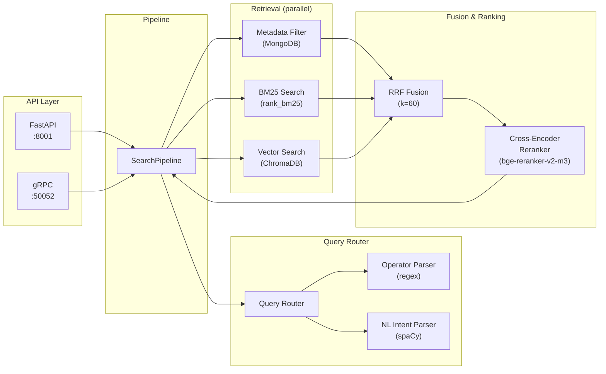

# AI Email Search Engine

A production-quality hybrid email search engine combining structured Gmail-style operators, BM25 keyword search, semantic vector search, and cross-encoder reranking.

## Architecture



## Setup

### 1. Prerequisites

- Python 3.11+
- MongoDB running on `localhost:27017`
- NVIDIA GPU with CUDA support (recommended, CPU fallback available)

### 2. Install Dependencies

```bash
cd search_feature_demo

# Create virtual environment
python -m venv venv
venv\Scripts\activate  # Windows
# source venv/bin/activate  # Linux/Mac

# Install PyTorch with CUDA (do this FIRST)
pip install torch --index-url https://download.pytorch.org/whl/cu121

# Verify GPU
python -c "import torch; print(torch.cuda.is_available())"

# Install remaining dependencies
pip install -r requirements.txt

# Download spaCy model
python -m spacy download en_core_web_sm
```

### 3. Download ML Models (first run only)

```bash
# These scripts download the models to HuggingFace cache
python models/embedding.py   # gte-Qwen2-1.5B-instruct (~3GB)
python models/reranker.py    # bge-reranker-v2-m3 (~2.2GB)
```

### 4. Environment Variables

Create a `.env` file in `search_feature_demo/`:

```env
MONGO_URI=mongodb://localhost:27017/ai_email_manager
CHROMA_PERSIST_DIR=./chroma_data
DEVICE=auto

SEARCH_HTTP_PORT=8001
SEARCH_GRPC_PORT=50052

EMBEDDING_MODEL=Alibaba-NLP/gte-Qwen2-1.5B-instruct
RERANKER_MODEL=BAAI/bge-reranker-v2-m3

CACHE_TTL_SECONDS=60
LOG_LEVEL=INFO
```

### 5. Run the Service

```bash
# Both HTTP + gRPC
python main.py

# HTTP only (FastAPI on port 8001)
python main.py --http-only

# gRPC only (port 50052)
python main.py --grpc-only
```

## API Usage

### Search

```bash
curl -X POST http://localhost:8001/api/v1/search \
  -H "Content-Type: application/json" \
  -d '{
    "query": "emails from Sarah about Q3 budget last week",
    "user_email": "user@example.com",
    "limit": 20
  }'
```

### Health Check

```bash
curl http://localhost:8001/api/v1/search/health
```

### Supported Operators

| Operator | Example | Description |
|----------|---------|-------------|
| `from:` | `from:sarah` or `from:"Sarah Johnson"` | Filter by sender |
| `to:` | `to:john` | Filter by recipient |
| `subject:` | `subject:budget` | Filter by subject keyword |
| `has:` | `has:attachment` | Filter by attachment presence |
| `after:` | `after:2024/01/15` | Emails after date |
| `before:` | `before:2024-06-30` | Emails before date |
| `is:` | `is:unread` or `is:read` | Read/unread filter |
| `label:` | `label:important` | Filter by label |
| `in:` | `in:inbox` | Filter by folder |

Operators can be combined with natural language: `from:sarah Q3 budget review after:2024/01/01`

## Testing

### Unit Tests

```bash
# Run all unit tests
pytest tests/unit/ -v

# With coverage (target ≥90% on router/ and retrieval/fusion.py)
pytest tests/unit/ -v --cov=router --cov=retrieval.fusion --cov-report=term-missing
```

### Integration Tests

Requires MongoDB running locally:

```bash
pytest tests/integration/ -v
```

### Benchmarks

```bash
# 10k corpus (quick)
python -m tests.benchmarks.bench_search --corpus-size 10000

# 100k corpus (p95 ≤ 500ms target)
python -m tests.benchmarks.bench_search --corpus-size 100000
```

Results are written to `tests/benchmarks/results.md`.

> **Note**: 1M-email corpus testing is a documented follow-up. Current benchmarks cover 10k and 100k sizes.

## Code Quality

```bash
# Format
black .

# Lint
ruff check .

# Fix auto-fixable issues
ruff check --fix .
```

## Key Design Decisions

1. **MongoDB over PostgreSQL**: The existing project uses MongoDB (Mongoose). Adding PostgreSQL would require a data sync pipeline and operational overhead for two databases. MongoDB's indexed queries handle all metadata filtering needs.

2. **rank_bm25 over Mongo $text**: True BM25Okapi scoring produces more nuanced relevance scores than MongoDB's `textScore`. Mongo `$text` is still used as a pre-filter in metadata search.

3. **Lazy-loaded reranker**: With 6GB VRAM shared between the embedding model (~3GB) and reranker (~2.2GB), the reranker loads on first use and falls back to CPU if CUDA OOM occurs.

4. **Separate service ports**: Runs on port 50052 (gRPC) and 8001 (HTTP), keeping the existing Q&A service on port 50051 untouched.

5. **spaCy for NL parsing**: Uses `en_core_web_sm` for lightweight NER instead of calling an LLM, keeping latency low with no API dependency.
